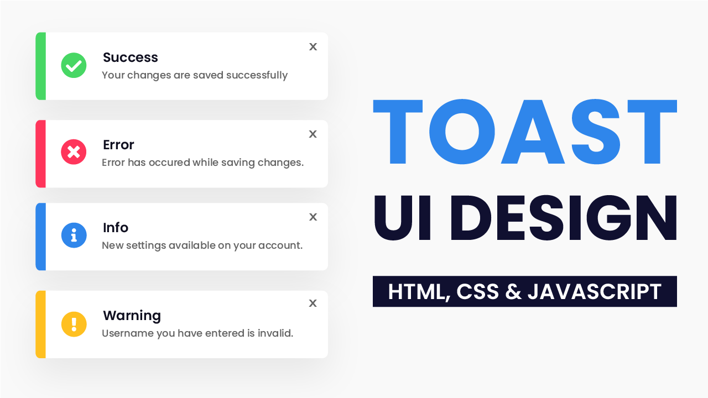
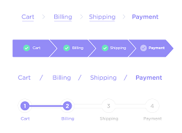

## Web Layout
Web Layout is the way we organize components in a web page
Basic Components in Web Page :
- Header
- Navigation ---> Navigation can be along with Header
- Main Content
- Footer
- Others :
    - Slideshow
    - Sidebar ---> can inlcude navigation
    - Tab bar 
    - Banner
    - Form
    - Dialog/Modal
    - Toast ----> Notification UI disappear after a few sec

    - Breadcrumb

## Landing Page Notes
Where to advertise or introduction the product
### Building the Skeleton
Google Font Emmbedd into web page (Download Approach). This Approach will help always have google font regardless of the web brower and not depend on the emmbedded Font URL.

Frist Download Font on Google after that convert from `https://transfonter.org/` (otf -> WOFF/WOFF2 for web optimized)

Web Brower can actually know what font file to be download for the web page to use based on the font used in the web page elements. Inspect from Network in Chrome Dev Tool

------
### NavBar 
First we build the structure with tags. But the element will stack up. And we need to use `Flex` display in css
```html copy
                <nav class="navbar">
                    <!-- Logo -->
                     
                     <!-- Navigation ul>li*5>a{Home} -->
                      <ul>
                        <li><a href="#!">Home</a></li>
                        <li><a href="#!">Features</a></li>
                        <li><a href="#!">Services</a></li>
                        <li><a href="#!">Resources</a></li>
                        <li><a href="#!">Contact</a></li>
                      </ul>
                      <!-- Actions -->
                       <div class="actions">
                        ACTIONS
                       </div>
                </nav>
```